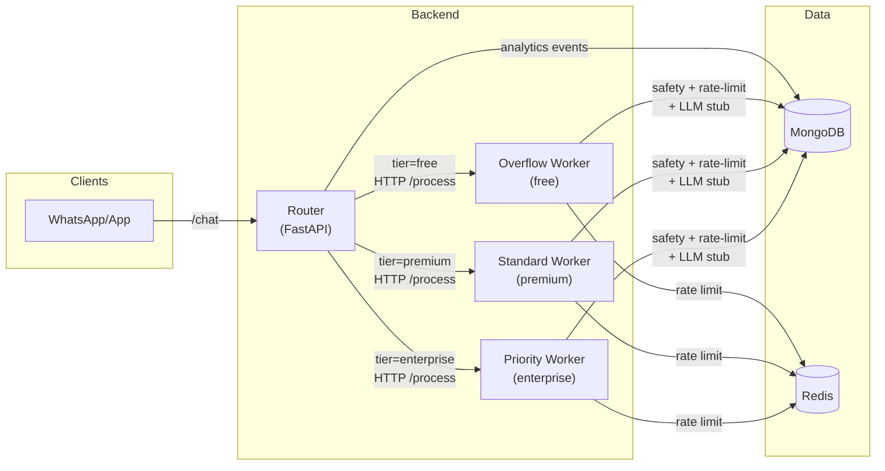

## High-Level System Design

### Components

- **WhatsApp/App clients** → external; hit the **router** via `/chat`.
- **Router (tier-aware load balancer)**:
  - FastAPI app (`services/router/app/main.py`).
  - Decides which pool to send each request to based on **tier** and **pool health**.
  - Forwards requests to worker pools over HTTP using `httpx`.
  - Emits **analytics events** (non-blocking) to Mongo.
- **Worker pools**:
  - `worker-priority` (enterprise / reserved capacity)
  - `worker-standard` (default for premium)
  - `worker-overflow` (best-effort, mostly free)
  - Each worker:
    - Runs FastAPI `/process`.
    - Applies **safety** and **rate limiting**.
    - Talks to Mongo (sessions/messages/personalities).
    - Emits logs and (optionally) analytics.
- **MongoDB**:
  - Collections: `users`, `personalities`, `sessions`, `messages`, `analytics_events`.
  - Backing store for session/message retrieval and analytics.
- **Redis**:
  - Used for **per-day session rate limiting** with “first notice then silent” behavior.
- **Seeder**:
  - One-shot service that generates ~1M docs per collection for benchmarks.

### Data Flow (request lifecycle)

1. **Client → Router**
   - `POST /chat { user_id, message, tier }`
   - Correlation ID middleware sets `X-Correlation-Id` and captures context.
2. **Router → Tier Router**
   - Router calls `TierRouter.route_and_call()` with tier + payload.
   - TierRouter chooses candidate pools based on tier and pool health:
     - Enterprise: `priority` → `overflow`
     - Premium: `standard` → `overflow` → `priority`
     - Free: `overflow` only
3. **Router → Worker**
   - Router uses `PoolManager.call_process()` to forward JSON payload to chosen pool’s `/process`.
   - PoolManager tracks **in-flight** and **EWMA latency** and enforces per-pool concurrency.
4. **Worker pipeline**
   - Safety check:
     - If unsafe (jailbreak/NSFW/violence/self-harm/hate) → personality-aware refusal.
   - Rate limit (per day, per user, per tier):
     - Enterprise: unlimited.
     - Premium: 100 messages/day.
     - Free: 10 messages/day.
     - On first over-limit event → friendly “I need to rest; text me later” reply; subsequent → silent (`reply=null`).
   - LLM stub:
     - Simulated latency per pool; in real system this would call an LLM backend.
   - Response JSON sent back to router.
5. **Router → Client**
   - Router adds `rate_limited`, `silent`, `blocked`, `degraded` flags into the response.
   - Response returned to client with `X-Correlation-Id`.
6. **Analytics**
   - Router enqueues an analytics event (user_id, tier, pool, latency, rate_limited, safety_blocked, degraded) into a bounded queue.
   - Background flusher batches events and writes to `analytics_events` in Mongo.

### High-Level Diagram (Mermaid)

