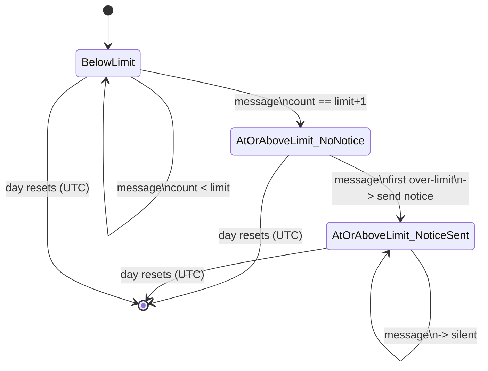
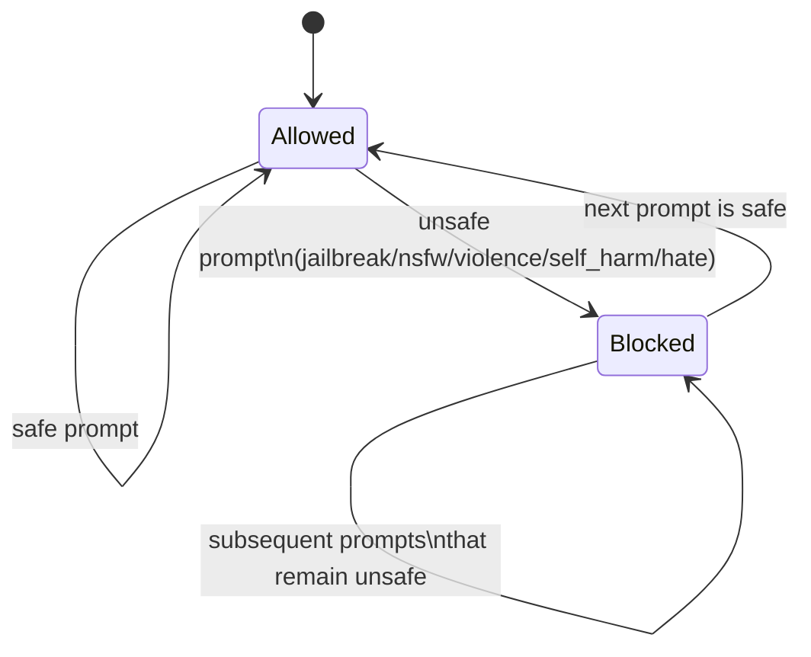
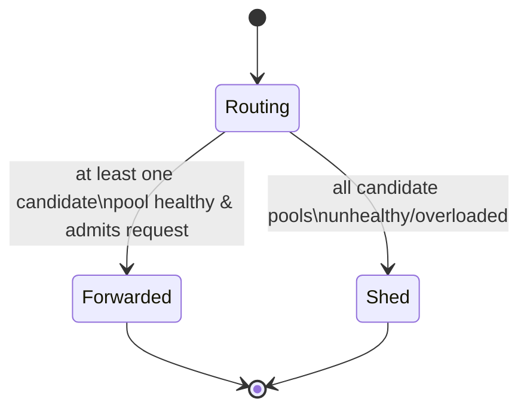
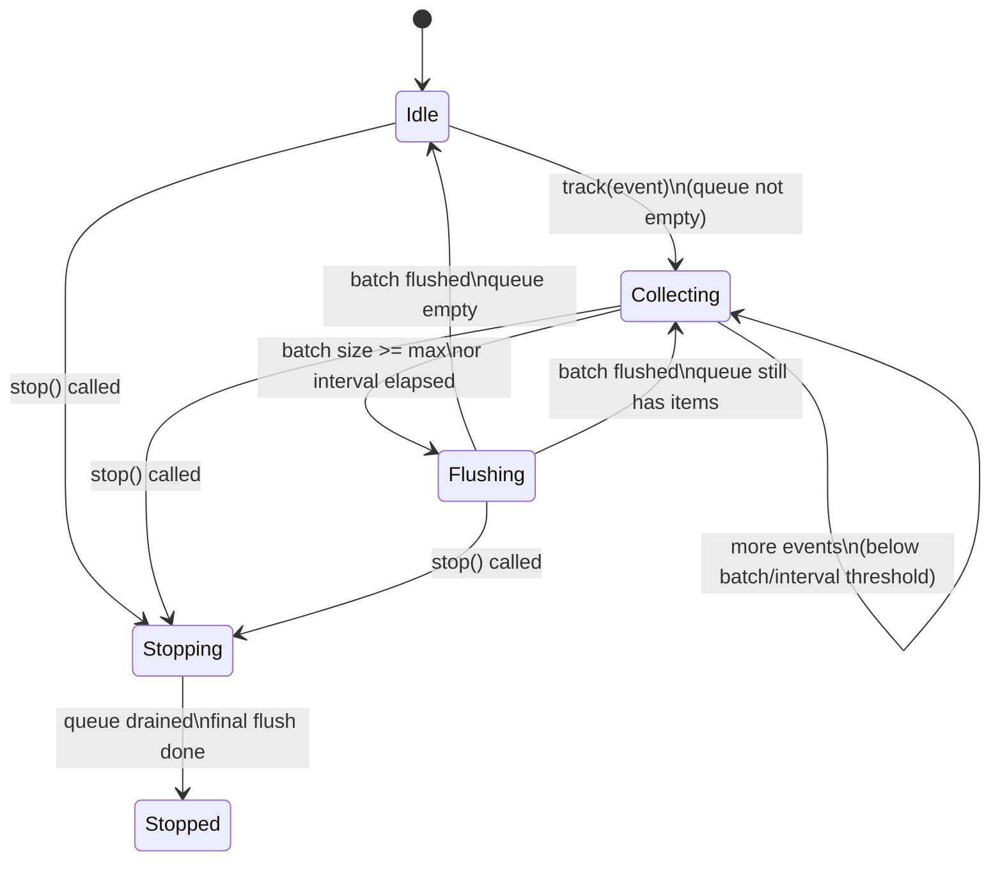

## State Machines

### Rate Limiting (per user per day, per tier)

States (logical view for a given user + day):

- `BelowLimit`: user is under daily quota.
- `AtOrAboveLimit_NoNotice`: user has just crossed the limit; no friendly notice sent yet.
- `AtOrAboveLimit_NoticeSent`: user is over the limit and notice has already been sent.

Transitions:

Implementation mapping:

- `BelowLimit`: count key `< limit`; limiter returns `allowed=True`.
- `AtOrAboveLimit_NoNotice`:
  - count > limit AND `notice` key doesn’t exist; limiter sets notice key (`NX`) and returns `first_notice=True`.
- `AtOrAboveLimit_NoticeSent`:
  - count > limit AND `notice` key exists; limiter returns `first_notice=False`.

Workers interpret the result as:

- `allowed=True` → process normally.
- `allowed=False, first_notice=True` → send human “I need rest” reply.
- `allowed=False, first_notice=False` → silent (reply=null).

### Safety Blocking

States:

- `Allowed`: prompt passes safety checks.
- `Blocked`: prompt matches at least one unsafe category.

Transitions:

Implementation mapping:

- Each message is evaluated independently (`detect_unsafe`).
- No long-lived state; blocking decision is per-request.

Worker behavior:

- If `Blocked`:
  - Respond with refusal_message (tone + category).
  - Mark response as `blocked=True`.
- If `Allowed`:
  - Proceed to rate limiting and processing pipeline.

### Tier-Aware Routing / Degradation

States (per request at router):

- `Routing`: evaluating candidate pools.
- `Forwarded`: successfully forwarded to a worker pool.
- `Shed`: could not forward (all pools unhealthy/overloaded) → graceful degradation message.

Transitions:

Tier-specific candidate sets:

- Enterprise:
  - `["priority", "overflow"]`
- Premium:
  - `["standard", "overflow", "priority"]`
- Free:
  - `["overflow"]`

Degradation semantics:

- Enterprise:
  - Prefer priority; only falls back to overflow if needed.
  - Never displaced by lower tiers (router checks pool health/load, not global fairness).
- Premium:
  - Uses standard under normal conditions; may fall back to overflow or priority.
- Free:
  - Only uses overflow; under heavy load, router may respond with a friendly “I’m busy” message (Shed).

### Analytics Queue / Flusher

States:

- `Idle`: queue empty, flusher waiting.
- `Collecting`: events being enqueued; batch being built.
- `Flushing`: writing batch to Mongo.
- `Stopping`: stop signal received; draining remaining events.
- `Stopped`: background task finished.

Transitions:

Implementation details:

- `analytics.start()`:
  - Spawns background task (`_run`) which loops until `_stopping` and queue empty.
- `analytics.track(event)`:
  - `put_nowait` into bounded queue; if full, increments drop counter.
- `analytics.stop()`:
  - Sets `_stopping=True` and awaits flusher task.

